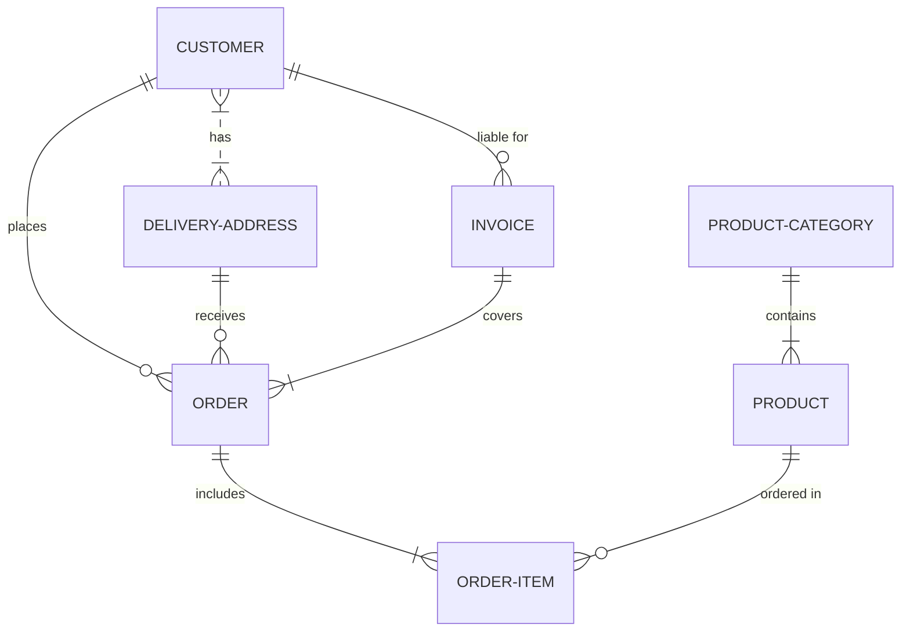

# Sistema Gestor de Ventas 

**Asignatura**: Bases de Datos I (FaCENA-UNNE)

**Integrantes**:
 - Altamirano Adrian Axel  
 - Cardozo Carola Guillermina
 - Czachurski Veronica Camila 
 - Marano Bruno Joel

**Año**: 2024

## CAPÍTULO I: INTRODUCCIÓN

### Caso de estudio: Sistema Gestor de Ventas

El tema de este proyecto es el desarrollo de una base de datos para un sistema gestor de ventas. Este sistema tiene como objetivo optimizar la gestión y el control de las ventas de productos, así como la compra de insumos a proveedores, con la finalidad de mejorar la administración de un negocio. La base de datos está diseñada para manejar la información relacionada con clientes, proveedores, productos, compras, ventas, usuarios, y las transacciones financieras involucradas. De esta manera, el sistema ofrecerá una solución integral para la organización y el manejo eficiente de un negocio dedicado a la venta de productos. 

### Definición o planteamiento del problema

En la actualidad, muchos pequeños y medianos negocios enfrentan dificultades para gestionar de manera eficiente sus procesos de ventas y compras. El control manual o mediante sistemas no integrados genera retrasos en las transacciones, errores en la gestión de inventarios, dificultades para llevar un registro claro de los pagos, y falta de visibilidad en el estado de las ventas y compras. Estos problemas afectan directamente la rentabilidad del negocio y la calidad del servicio al cliente.

Este proyecto busca resolver la ineficiencia en la gestión de ventas y compras en los negocios. La falta de una base de datos estructurada y un sistema que permita administrar de manera centralizada las relaciones con clientes, proveedores, productos, facturación, y métodos de pago, genera un entorno caótico y poco productivo. Para abordar este problema, se propone desarrollar un sistema gestor de ventas que centralice todos estos procesos y facilite el acceso a la información de manera rápida y confiable.

### Objetivo del Trabajo Práctico

Este trabajo tiene como objetivo general diseñar y desarrollar una base de datos que permita gestionar de manera eficiente las ventas y compras en un negocio, proporcionando un sistema robusto que permita llevar el control de los productos, clientes, proveedores, usuarios, y métodos de pago, así como la emisión de tickets y facturas.

## Objetivo General
El objetivo general de este proyecto es desarrollar una base de datos relacional que integre los procesos de compra y venta de productos, optimizando la gestión del negocio mediante un sistema centralizado que permita el control eficiente de los recursos y transacciones.

## Objetivos Específicos
1. Diseñar una base de datos que contenga todas las entidades y relaciones necesarias para gestionar el ciclo de ventas y compras de productos, incluyendo entidades como Cliente, Proveedor, Producto, Venta, Compra, Factura, y Métodos de Pago.
2. Implementar un modelo de datos que permita gestionar de manera eficiente el inventario de productos, con información sobre precios de compra, precios de venta, categorías, y proveedores.
3. Desarrollar un sistema para gestionar las ventas que permita registrar y procesar las transacciones de manera automatizada, generando facturas y tickets para los clientes, y llevando un control claro de los métodos de pago utilizados.
4. Optimizar el control de usuarios y roles dentro del sistema, permitiendo la asignación de diferentes niveles de acceso según el rol del usuario (administrador, vendedor, etc.).
5. Facilitar el seguimiento de compras realizadas a proveedores, con el objetivo de mantener un inventario actualizado y minimizar el riesgo de desabastecimiento.
6. Implementar una solución que permita la emisión de reportes sobre ventas, compras, y otros indicadores clave de rendimiento para el negocio.

### Alcance del proyecto

Este trabajo abarca el diseño, implementación y documentación de una base de datos relacional que permitirá gestionar de manera eficiente las operaciones de ventas y compras de productos. El sistema está diseñado para ser utilizado por usuarios con diferentes roles (administradores, vendedores, supervisor), cada uno con accesos y funcionalidades específicas. La solución proporcionará una interfaz centralizada para gestionar clientes, proveedores, productos, inventarios, métodos de pago y facturación, cubriendo todos los aspectos críticos de la operación de un negocio dedicado a la venta de productos.

## CAPITULO II: MARCO CONCEPTUAL O REFERENCIAL

**TEMA 1 " ---- "** 
Ut sed imperdiet risus. Maecenas vestibulum arcu vitae orci pretium pharetra. Suspendisse potenti. Fusce massa libero, fermentum eget elit in, tincidunt fermentum nunc. Cras imperdiet nisl elit, elementum gravida enim accumsan vel. Sed in sapien quis ante consectetur commodo id non nulla. Aenean lacinia, dolor convallis semper mattis, ante orci elementum nunc, eget feugiat risus neque in urna. Ut ut quam nec risus mollis convallis ornare ac odio. Phasellus efficitur posuere nibh, eget tempor augue pellentesque ac. Ut enim sem, imperdiet non est ut, blandit posuere dui. Curabitur at purus orci. Interdum et malesuada fames ac ante ipsum primis in faucibus.

**TEMA 2 " ----- "** 
Ut sed imperdiet risus. Maecenas vestibulum arcu vitae orci pretium pharetra. Suspendisse potenti. Fusce massa libero, fermentum eget elit in, tincidunt fermentum nunc. Cras imperdiet nisl elit, elementum gravida enim accumsan vel. Sed in sapien quis ante consectetur commodo id non nulla. Aenean lacinia, dolor convallis semper mattis, ante orci elementum nunc, eget feugiat risus neque in urna. Ut ut quam nec risus mollis convallis ornare ac odio. Phasellus efficitur posuere nibh, eget tempor augue pellentesque ac. Ut enim sem, imperdiet non est ut, blandit posuere dui. Curabitur at purus orci. Interdum et malesuada fames ac ante ipsum primis in faucibus.

...

## CAPÍTULO III: METODOLOGÍA SEGUIDA 

Donec lobortis tincidunt erat, non egestas mi volutpat in. Cras ante purus, luctus sed fringilla non, ullamcorper at eros.

 **a) Cómo se realizó el Trabajo Práctico**
Vestibulum rutrum feugiat molestie. Nunc id varius augue. Ut augue mauris, venenatis et lacus ut, mattis blandit urna. Fusce lobortis, quam non vehicula scelerisque, nisi enim ultrices diam, ac tristique libero ex nec orci.

 **b) Herramientas (Instrumentos y procedimientos)**
Donec lobortis tincidunt erat, non egestas mi volutpat in. Cras ante purus, luctus sed fringilla non, ullamcorper at eros. Integer interdum id orci id rutrum. Curabitur facilisis lorem sed metus interdum accumsan. 

## CAPÍTULO IV: DESARROLLO DEL TEMA / PRESENTACIÓN DE RESULTADOS 

Maecenas molestie lacus tincidunt, placerat dolor et, ullamcorper erat. Mauris tortor nisl, ultricies ac scelerisque nec, feugiat in nibh. Pellentesque interdum aliquam magna sit amet rutrum. 

### Diagrama conceptual (opcional)
Ejemplo usando Live Editor https://mermaid.js.org/ (ejemplo opcional)

### Diagrama relacional

### Diccionario de datos

Acceso al documento [PDF](doc/diccionario_datos.pdf) del diccionario de datos.

### Desarrollo TEMA 1 "----"

Fusce auctor finibus lectus, in aliquam orci fermentum id. Fusce sagittis lacus ante, et sodales eros porta interdum. Donec sed lacus et eros condimentum posuere. 

> Acceder a la siguiente carpeta para la descripción completa del tema [scripts-> tema_1](script/tema01_nombre_tema)

### Desarrollo TEMA 2 "----"

Proin aliquet mauris id ex venenatis, eget fermentum lectus malesuada. Maecenas a purus arcu. Etiam pellentesque tempor dictum. 

> Acceder a la siguiente carpeta para la descripción completa del tema [scripts-> tema_2](script/tema02_nombre_tema)

... 

## CAPÍTULO V: CONCLUSIONES

Nunc sollicitudin purus quis ante sodales luctus. Proin a scelerisque libero, vitae pharetra lacus. Nunc finibus, tellus et dictum semper, nisi sem accumsan ligula, et euismod quam ex a tellus. 

## BIBLIOGRAFÍA DE CONSULTA

 1. List item
 2. List item
 3. List item
 4. List item
 5. List item

